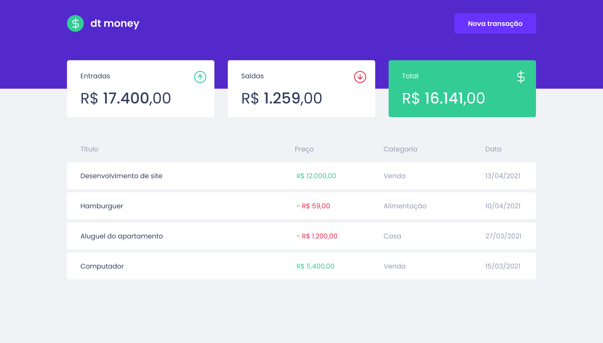
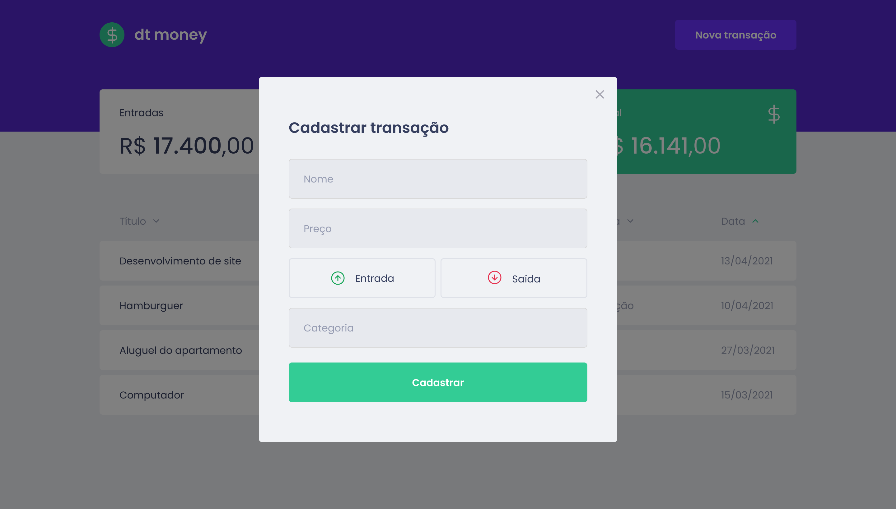

<p align="center">
  
</p>

---

## :computer: Sobre
Este projeto consiste em um gerenciador de finanças. Nele é possível registrar todas as entradas e saídas de dinheiro, e é possível visualizar o valor total de todas as transações.

## :camera: Demonstração
<p align="center">
  
  
</p>


## :rocket: Como iniciar
1. Antes de iniciar a aplicação, é necessário instalar todas as dependências necessárias para o seu funcionamento. Para isso, certifique-se de ter o **Yarn** instalado, e em seguida digite este comando no **terminal/cmd**, e aguarde:
    ```
    yarn
    ```
2. Após o download das dependências, basta digitar este comando que a aplicação será iniciada:
    ```
    yarn start
    ```

## :alien: Tecnologias
As tecnologias principais utilizadas neste projeto são as seguintes:
- React
- Styled Components
- Miragejs
- Axios
